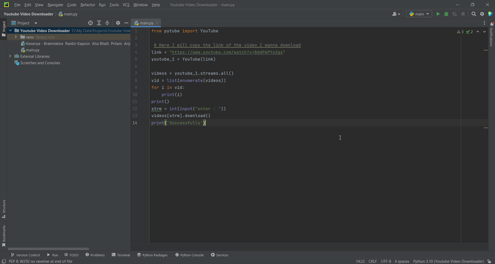
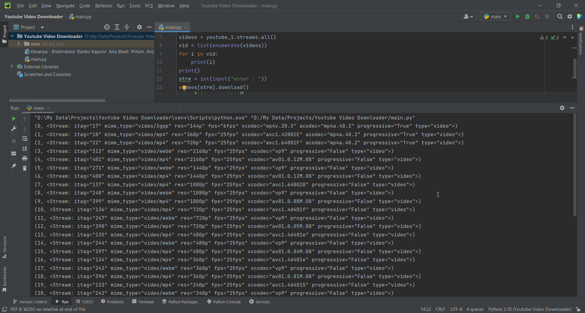
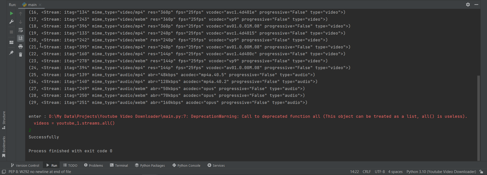

### YouTube Video Downloader

YouTube Video Downloader is a project through which a user can download any Youtube video as per their choice of the resolution. All we can do is just to provide the link of that particular video.

**Tools Used**

I have made this project using Python3.

**End Results:**
*Images:*

| Screenshot 1 |  |
|--|--|
| Screenshot 2 |  |
| Screenshot 3 |  |

*Video:*

https://user-images.githubusercontent.com/84437844/198500281-da249940-8a83-4c40-8e4b-25b3ce94c285.mp4

